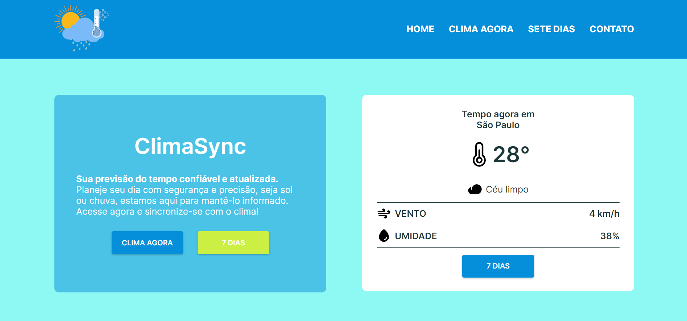

<h1 align="center"> ClimaSync </h1>

<p align="center">
  ClimaSync é uma aplicação web onde você pode ver as condições climáticas de qualquer lugar do mundo em tempo real<br/>
</p>

<p align="center">
  <a href="#-tecnologias">Tecnologias</a>&nbsp;&nbsp;&nbsp;|&nbsp;&nbsp;&nbsp;
  <a href="#-instalação-do-projeto">Instalação do projeto</a>&nbsp;&nbsp;&nbsp;|&nbsp;&nbsp;&nbsp;
  <a href="#-sobre-o-projeto">Sobre o Projeto</a>&nbsp;&nbsp;&nbsp;
</p>

<p align="center">
  
</p>

<p align="center">
  <a href="https://vs12-front-react-climasync.vercel.app/" target="_blank">➡️ Acesse o deploy!</a>
</p>

## 🚀 Tecnologias

Esse projeto foi desenvolvido com as seguintes tecnologias:

- React

## ⚙️ Instalação do projeto

Passo-a-passo:

1. Comandos necessários para executar:

```
npm i
npm start
```

> O projeto é uma aplicação web e é necessário um navegador web para executá-lo.

## 💻 Sobre o Projeto

O projeto é uma aplicação web onde você pode ver as condições climáticas de qualquer lugar do mundo em tempo real e a previsão para os próximos 7 dias.

<a href="https://www.figma.com/file/8dnkAc5OJeLOs8sYZYPlJ5/ClimaSync?type=design&node-id=4%3A100&mode=design&t=pRvf9tuO2aAwcOM1-1" target="_blank">➡️ Link do figma</a>
